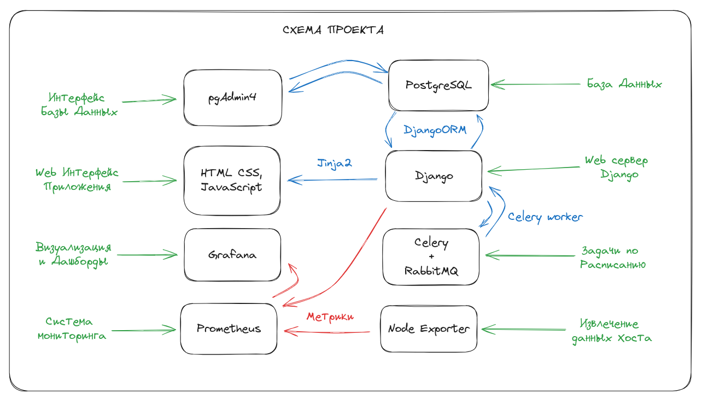

<!-- Header section -->
<p align="center">
 
</p>

&nbsp;&nbsp;&nbsp;&nbsp;&nbsp;&nbsp;&nbsp;&nbsp;&nbsp;&nbsp;&nbsp;&nbsp;&nbsp;&nbsp;&nbsp;&nbsp;&nbsp;&nbsp;&nbsp;&nbsp;&nbsp;&nbsp;&nbsp;&nbsp;&nbsp;&nbsp;&nbsp;&nbsp;&nbsp;&nbsp;&nbsp;&nbsp;&nbsp;&nbsp;&nbsp;&nbsp;&nbsp;&nbsp;&nbsp;&nbsp;&nbsp;&nbsp;&nbsp;&nbsp;&nbsp;&nbsp;&nbsp;&nbsp;&nbsp;&nbsp;&nbsp;&nbsp;&nbsp;&nbsp;&nbsp;&nbsp;&nbsp;


[](https://opensource.org/licenses/MIT)

## 📋 Table of Contents

1. 🌀 [Описание проекта](#what-is-this)
2. 🌟 [Возможности сервиса](#features)
2. 📈 [Описание схемы БД](#database_scheme)
3. 🚀 [Инструкция по установке](#installation)
5. 💯 [Тесты](#tests)
6. ©️ [License](#license)

## <a name="what-is-this"> 🌀 Описание проекта</a>

GoodNews представляет собой веб-портал на основе Django с публикациями статьями и блогами.
Благодаря своим функциям GoodNews выступает в качестве площадки, на которой 
современные писатели могут свою аудиторию и найти вдохновение в чужих работах. 


База данных - `PostgreSQL`. ORM - `DjangoORM`. 
Асинхронные задачи - `Celery`. Брокер сообщений - `RabbitMQ`. 
Интерфейс - `Jinja2`, `HTML`, `CSS`, `JavaScript`.
Контейнеризация - `Docker-Compose`. Зависимости - `Poetry`. Линтер - `Flake8`.
Мониторинг - `Prometheus`. Метрики хоста - `Node Exporter`. Визуализация - `Grafana`.




## <a name="features"> 🌟 Возможности сервиса </a>

<details>
<summary>ЛЕНТА СТАТЕЙ</summary>

>Каждый пользователь имеет доступ к ленте статей. 
Лента представляет собой несколько случайных статей и список аннотаций,
отсортированный по убыванию даты публикации. Каждая аннотация ведет 
на отдельную страницу с детальной информацией о статье. На этой странице 
пользователь получает доступ к полному тексту статьи и список комментариев
других пользователей. Авторизованные пользователи могут добавлять свои комментарии.
> 
</details>

<details>
<summary>ПОЛНОТЕКСТОВЫЙ ПОИСК ПО КАТАЛОГУ СТАТЕЙ</summary>

>Для удобства пользователя реализован полнотекстовый поиск по названию и тексту статьи.

</details>

<details>
<summary>ЛИЧНЫЙ КАБИНЕТ(ЛК)</summary>

>После авторизации пользователь может устанавливать картинку профиля (аватар). 
Также в личном кабинете можно просматривать и редактировать список категорий статей, 
на которые пользователь подписан.

</details>

<details>
<summary>УПРАВЛЕНИЕ ПУБЛИКАЦИЯМИ</summary>

>В личном кабинете каждый авторизованный пользователь может создавать/редактировать/удалять 
собственные статьи. При создании статьи требуется уточнить название, написать текст и выбрать 
одну или несколько категорий, к которым относится статья.

</details>

<details>
<summary>ПОДПИСКА НА КАТЕГОРИИ</summary>

>Авторизованый пользователь получает доступ к странице категорий. 
Страница категорий представляет собой список категорий статей 
существующих на портале. К каждой категории приводится статистическая сводка: о
количестве доступных публикаций, количество комментариев ко всем статьям категории,
количествo подписчиков.

</details>


## <a name="database_scheme"> 📈 База данных </a>

База данных содержит 6 моделей: 
**Автор публикации** (Author), 
**Категория статьи** (Category), 
**Cтатья** (Post),
**Статья в категории** (PostCategory), 
**Подписчик на категорию** (UserCategory), 
**Комментарий** (Comment)


<details>
<summary>ДЕТАЛЬНАЯ ИНФОРМАЦИЯ О МОДЕЛЯХ </summary>

1. Автор публикации (Author)
    - Пользователь (user)
    - Дата создания (creation_date)
    - Картинка профиля (photo)
    - Рейтинг автора (author_rating)


2. Категория статьи (Category)
    - Название (title)
    - Картинка категории(image)
    - Подписчики(subscribers)


3. Cтатья (Post)
    - Автор (author)
    - Название title
    - Текст (text)
    - Статус публикации (type)
    - Дата создания (creation_date)
    - Категории (categories)
    - Рейтинг статьи (post_rating)


4. Статья в категории (PostCategory)
    - Статья (post)
    - Категория (category)
    - Подписчики(subscribers)


5. Подписчик на категорию (UserCategory)
    - Пользователь (user)
    - Категория (category)


6. Комментарий (Comment)
    - Пользователь (user)
    - Статья (post)
    - Дата создания (creation_date)
    - Рейтинг статьи (comment_rating)

</details>

<details>
<summary>ДЕТАЛЬНАЯ СХЕМА БАЗЫ ДАННЫХ</summary>


</details>


## <a name="installation"> 🚀 Инструкция по установке</a>

1. ### Подготовка проекта

1.1 Клонируете репозиторий
```sh
git clone https://github.com/XanderMoroz/GoodNews-DRF.git
```

1.2 В корневой папки клонированного репозитория создаете файл .env

1.3 Заполняете файл .env по следующему шаблону:

```sh
################################################################################
# DJANGO APP Config
# Automatically setup app variables
################################################################################
SECRET_KEY='django-insecure-#)!-t1b(7&wr_7c%0m%w$(y@^#z6wizw^trm$dtz70@m1fe$6*'
DJANGO_SUPERUSER_USERNAME=root
DJANGO_SUPERUSER_EMAIL=root@root.com
DJANGO_SUPERUSER_PASSWORD=123
################################################################################
# POSTGRESQL Config
# Automatically create database and user
################################################################################
DB_NAME="goodNews"
DB_USER="xander"
DB_PASSWORD="pass:123"
DATABASE_PORT=5432
DATABASE_HOST="localhost"               # при использовании локально
DATABASE_HOST="goodNews-postgres"       # при использовании c Docker
################################################################################
# PGADMIN Config
# Automatically setup interface for DB
################################################################################
PGADMIN_DEFAULT_EMAIL=xander@admin.com
PGADMIN_DEFAULT_PASSWORD=pwd123
################################################################################
# CELERY BROKER Config
# Automatically setup message broker for celery
################################################################################
CELERY_BROKER_HOST=rabbitmq

```
2. ### Запуск проекта с Doker
2.1 Создаете и запускаете контейнер через терминал:
```sh
sudo docker-compose up -d
```
2.2 Создаете суперпользователя и заполняете поля:
```sh
sudo docker exec -it goodnews-drf_web_1 python manage.py createsuperuser
```
2.3 Сервис доступен по адресу: http://0.0.0.0:8000/
2.3 Сервисы доступны для эксплуатации:

- Приложение Python `Django APP`: http://127.0.0.1:8080/
- Брокер сообщений `RabbitMQ`: http://127.0.0.1:15672/
- Интерфейс для управления БД Postgres `PGAdmin4`: http://127.0.0.1:5050                    
- Система мониторинга (сбора метрик) `Prometheus`: http://127.0.0.1:9090                  
- Извлекает метрики хоста (cpu-, memory-usage) для мониторинга `Node Exporter`: http://127.0.0.1:9100/              
- Аналитическая система (визиализирует данные в виде дашбордов) `Grafana`: http://127.0.0.1:3000                     


3. ### Дополнительные настройки 

<details>
<summary>Как подключить PGAdmin4 к БД? </summary>


1. Заходим в браузер по адресу http://127.0.0.1:5050 и вводим данные из .env

```bash
PGADMIN_DEFAULT_EMAIL=xander@admin.com
PGADMIN_DEFAULT_PASSWORD=pwd123
```


2. Заполняем Имя сервера (обязательно) 


3. Извлекаем адрес хоста, на котором расположилась БД Postgres

```bash
sudo docker inspect go_blog_postgres | grep IPAddress
```


4. Заполняем Адрес сервера данными хоста БД Postgres и пароль (из файла .env)


6. Готово


</details>


<details>
<summary>Как подключить Grafana к Prometheus? </summary>


1. Заходим в браузер по адресу http://127.0.0.1:3000 и вводим данные по умолчанию:

  - Email or username: admin
  - Password: admin


2. После система потребует придумать новый пароль (это необязательно).


3. Мы авторизованы в сервисе Grafana. Добавим новое подключение...


4. Ищем в списке Prometheus и кликаем по нему


5. Теперь его нужно настроить


7. Извлекаем адрес хоста, на котором расположился Prometheus

```bash
sudo docker inspect prometheus | grep IPAddress
```


8. Заполняем Адрес сервера Prometheus данными хоста 


9. Готово

</details>


## <a name="license"> ©️ License
