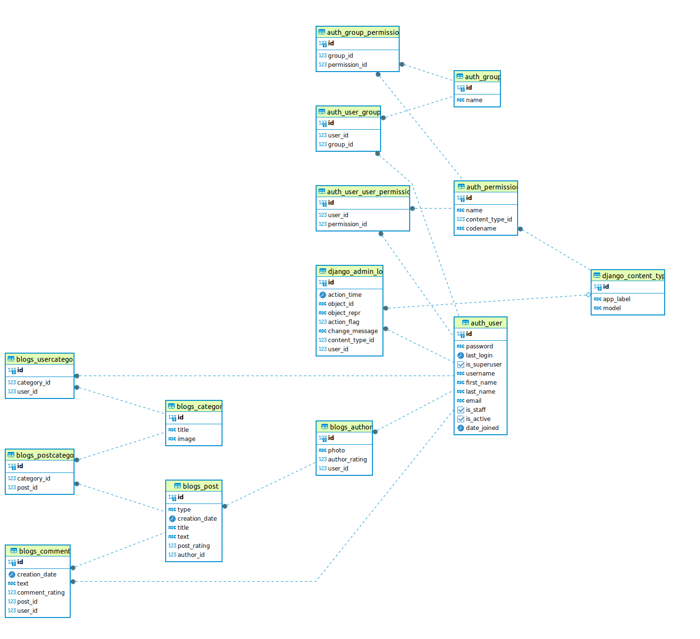

<p align="center"></p>
<p align="center"></p>

&nbsp;&nbsp;&nbsp;&nbsp;&nbsp;&nbsp;&nbsp;&nbsp;&nbsp;&nbsp;&nbsp;&nbsp;&nbsp;&nbsp;&nbsp;&nbsp;&nbsp;&nbsp;&nbsp;

[](https://github.com/anfederico/clairvoyant/issues)

[](https://opensource.org/licenses/MIT)

## 📋 Table of Contents

1. 🌀 [Описание проекта](#what-is-this)
2. 🌟 [Возможности сервиса](#features)
2. 📈 [Описание схемы БД](#database_scheme)
3. 🚀 [Инструкция по установке](#installation)
5. 💯 [Тесты](#tests)
6. ©️ [License](#license)

## <a name="what-is-this-api"> 🌀 Описание проекта</a>

GoodNews представляет собой веб-портал на основе Django с публикациями статьями и блогами.
Благодаря своим функциям GoodNews выступает в качестве площадки, на которой 
современные писатели могут свою аудиторию и найти вдохновение в чужих работах. 
База данных - `PostgreSQL`. ORM - `DjangoORM`. Интерфейс = `Jinja2`, `HTML`, `CSS`, `JavaScript`.
Контейнеризация - `Docker`. Зависимости - `Poetry`. Линтер - `Flake8`.

## <a name="features"> 🌟 Возможности сервиса </a>

<details>
<summary>ЛЕНТА СТАТЕЙ</summary>

>Каждый пользователь имеет доступ к ленте статей. 
Лента представляет собой несколько случайных статей и список аннотаций,
отсортированный по убыванию даты публикации. Каждая аннотация ведет 
на отдельную страницу с детальной информацией о статье. На этой странице 
пользователь получает доступ к полному тексту статьи и список комментариев
других пользователей. Авторизованные пользователи могут добавлять свои комментарии.
> 
</details>

<details>
<summary>ПОЛНОТЕКСТОВЫЙ ПОИСК ПО КАТАЛОГУ СТАТЕЙ</summary>

>Для удобства пользователя реализован полнотекстовый поиск по названию и тексту статьи.

</details>

<details>
<summary>ЛИЧНЫЙ КАБИНЕТ(ЛК)</summary>

>После авторизации пользователь может устанавливать картинку профиля (аватар). 
Также в личном кабинете можно просматривать и редактировать список категорий статей, 
на которые пользователь подписан.

</details>

<details>
<summary>УПРАВЛЕНИЕ ПУБЛИКАЦИЯМИ</summary>

>В личном кабинете каждый авторизованный пользователь может создавать/редактировать/удалять 
собственные статьи. При создании статьи требуется уточнить название, написать текст и выбрать 
одну или несколько категорий к которым относится статья.

</details>

<details>
<summary>ПОДПИСКА НА КАТЕГОРИИ</summary>

>Авторизованый пользователь получает доступ к странице категорий. 
Страница категорий представляет собой список категорий статей 
существующих на портале. К каждой категории приводится статистическая сводка о:
количестве доступных публикаций, количество комментариев ко всем статьям категории,
количестве подписчиков.

</details>


## <a name="database_scheme"> 📈 База данных </a>

>  База данных содержит 6 моделей: 
**Автор публикации** (Author), 
**Категория статьи** (Category), 
**Cтатья** (Post),
**Статья в категории** (PostCategory), 
**Подписчик на категорию** (UserCategory), 
**Комментарий** (Comment)


<details>
<summary>ДЕТАЛЬНАЯ ИНФОРМАЦИЯ О МОДЕЛЯХ </summary>

1. Автор публикации (Author)
    - Пользователь (user)
    - Дата создания (creation_date)
    - Картинка профиля (photo)
    - Рейтинг автора (author_rating)


2. Категория статьи (Category)
    - Название (title)
    - Картинка категории(image)
    - Подписчики(subscribers)


3. Cтатья (Post)
    - Автор (author)
    - Название title
    - Текст (text)
    - Статус публикации (type)
    - Дата создания (creation_date)
    - Категории (categories)
    - Рейтинг статьи (post_rating)


4. Статья в категории (PostCategory)
    - Статья (post)
    - Категория (category)
    - Подписчики(subscribers)


5. Подписчик на категорию (UserCategory)
    - Пользователь (user)
    - Категория (category)


6. Комментарий (Comment)
    - Пользователь (user)
    - Статья (post)
    - Дата создания (creation_date)
    - Рейтинг статьи (comment_rating)

</details>

>  Ниже представлена графическая схема моделей и их взаимосвязей.

<details>
<summary>ДЕТАЛЬНАЯ СХЕМА БАЗЫ ДАННЫХ</summary>



</details>


## <a name="database_scheme"> 🚀 Инструкция по установке

1. ### Подготовка проекта

1.1 Клонируете репозиторий
```sh
git clone https://github.com/XanderMoroz/GoodNews-DRF.git
```

1.2 В корневой папки клонированного репозитория создаете файл .env

1.3 Заполните файлe .env по следующему шаблону:

```sh
# DJANGO DEFAULT SETTINGS
SECRET_KEY='django-insecure-#)!-t1b(7&wr_7c%0m%w$(y@^#z6wizw^trm$dtz70@m1fe$6*'

# POSTGRESQL DEFAULT DATABASE
POSTGRES_USER=postgres
POSTGRES_PASS=postgres
POSTGRES_HOST=postgres  #localhost(при использовании локально)  
POSTGRES_PORT=5432
POSTGRES_DB=goodnews

```
2. ### Запуск проекта с Doker
2.1 Создаете и запускаете контейнер через терминал:
```sh
sudo docker-compose up -d
```
2.2 Создайте суперпользователя и заполните поля:
```sh
sudo docker exec -it goodnews-drf_web_1 python manage.py createsuperuser
```
2.3 Сервис доступен по адресу: http://0.0.0.0:8000/

## <a name="tests"> 💯 Тесты


## <a name="license"> ©️ License
